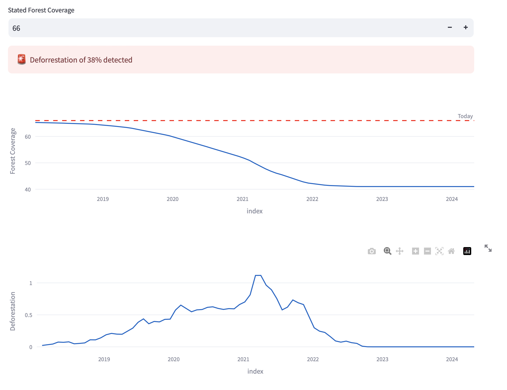
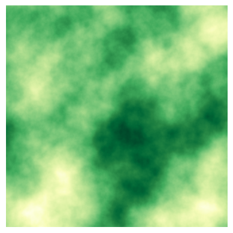
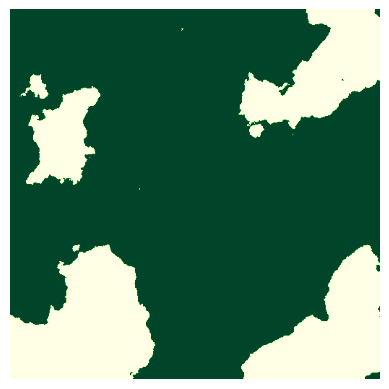
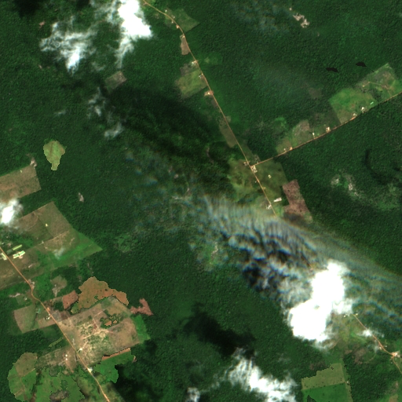
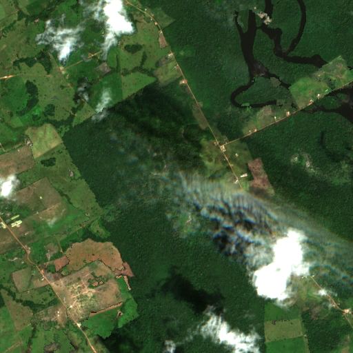

# Treetection
Presentation Link: https://drive.google.com/drive/folders/1gaeyEBRKYLTd3KTbv_A0TJVPGw9VXr9N?usp=sharing

## Interpolation of images using noise

We simulate deforestation over time by replacing forest areas with non-forest areas from different images. We use noise to interpolate between the two images and simulate an expanding are of deforestation.

